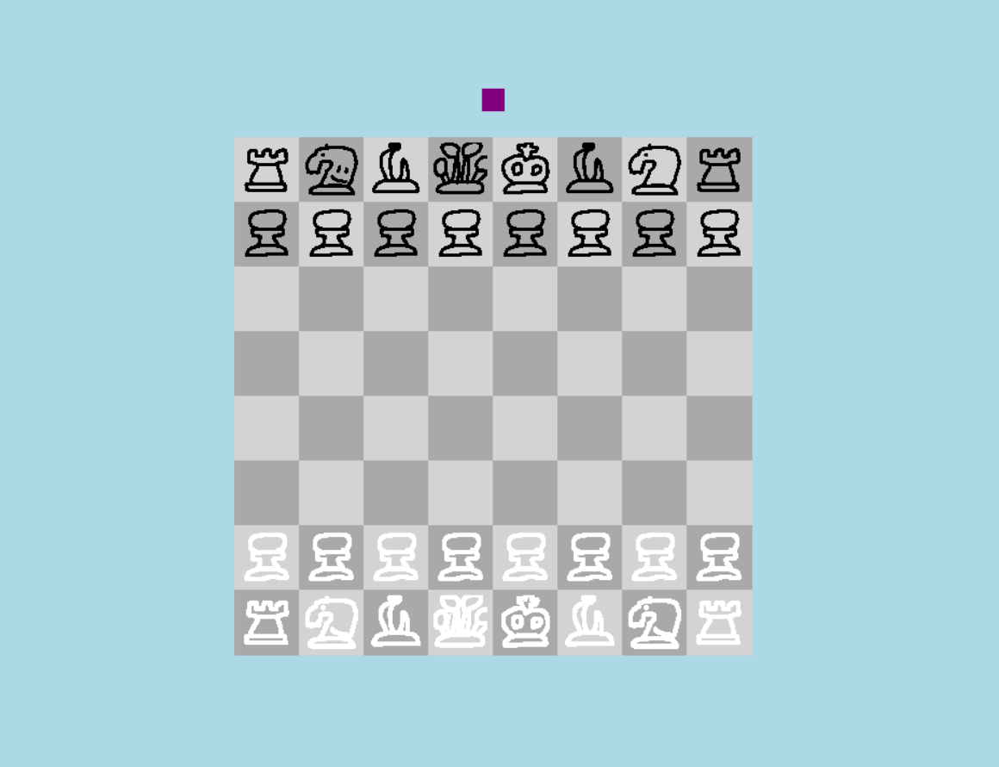

# chessgame

Python Chess

This project is a fully playable 2-player local chess game built in python using Turtle. The implementation of chess rules was done without the use of any chess libraries. There is no singleplayer or vs. AI mode.

## Features:
- Legal Move Validation: Players are unable to perform illegal moves
- Captures: Pieces can be captured, according to chess rules
- Turn Handling: Players cannot move when it is not their turn
- Check Detection: A fundamental tool in determining legal moves
- Checkmate: Checkmate situations are determined, and result in an end screen
- Stalemate: Stalemate situations result in draws
- Castling: All official chess rules followed in castling conditions
- En Passant/Pawn Promotion: Official chess rules followed, able to perform any legal move
- Insufficient-Material Draw: Automatically Detects insufficient material and ends game
- Play-Again: Option to restart game after any ending

## How to Run:
Download repo, keep all files (including .txt, .gif) in the same folder as chessmain.py. Run the python file.
How to Play:
The UI functions similar to chess.com. After clicking on any piece, the available moves appear in the form of highlighted circles. Clicking on an available square moves the piece.
The Checkmate function is not automatic, if checkmate is suspected you must click on the purple square on top of the board. If there is no checkmate, (or draw) nothing will happen. If there is, an end screen will show informing the user of the results.

## Implementation:
The board state is stored in chesslocations.txt, with each piece, color, and location. To generate moves, the program first generates coordinates a piece could potentially move to. Knights and kings have specific offsets, pawns have custom logic, and bishops, queens, and rooks expand outward until the end of the board. The program checks if the target position is empty, and the color of the piece in the position if it is filled.
After establishing possible moves, the program tests each one by temporarily modifying the board file with a move and checking to see if the moving player is currently in check. If the king is not in check, it is a legal move. The board file is then returned to normal. Checkmate operates similarly. It generates every legal move for every piece for the player whose turn it is. If that results in zero legal moves, and the king is in check, it is checkmate, and if the king is not in check it is a stalemate.
Special chess rules are handled separately. Castling tracks the king and rook movement history, if the spaces between them are empty, and temporarily moves the king through each square to see if it would pass through check. En passant stores temporary capture squares directly after a pawn has moved two spaces. Promotion creates clickable options after a pawn has reached the final rank.
